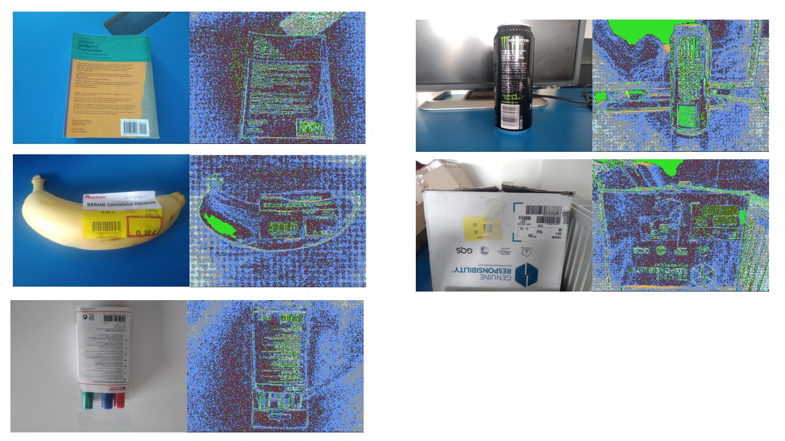
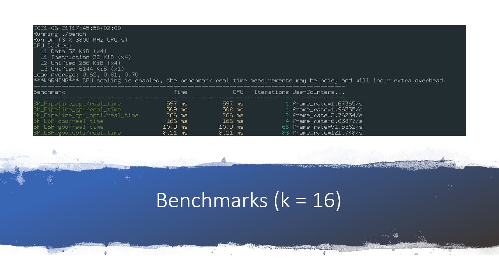
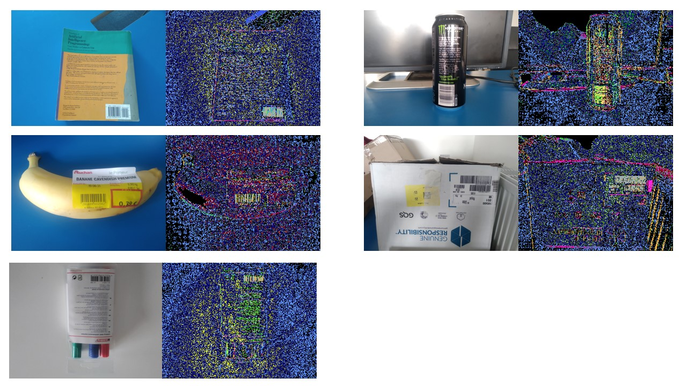
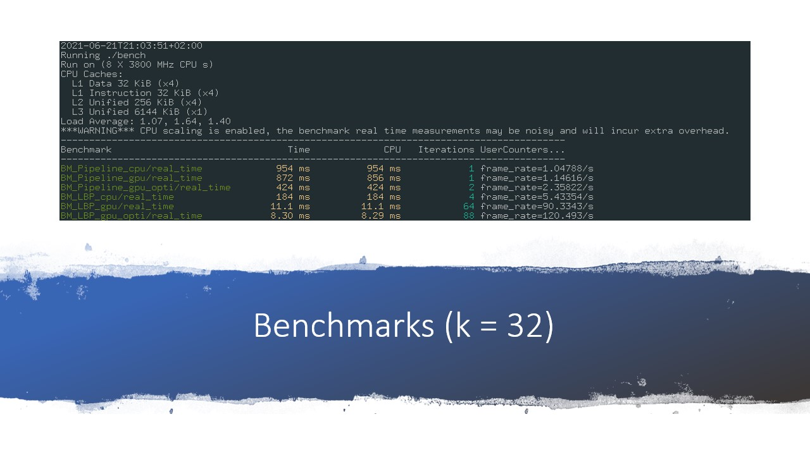
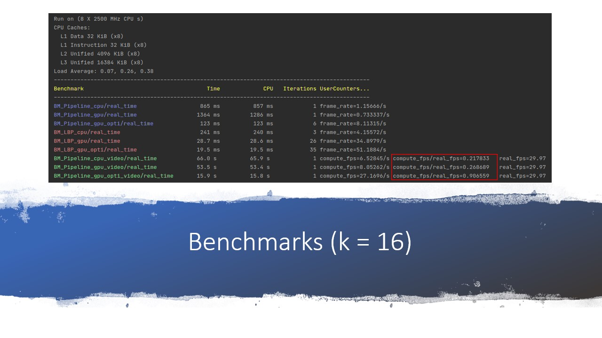

# gpgpu
Epita GPGPU Project: Local Binary Pattern on GPU


to compile:
```
mkdir build; cd build
cmake ..
make
```

to train the k-means:
```
./train [data]
```
(exemple : ./train data/\*.jpg)

\
to test the gpu optimized:
```
./test [-m GPU-OPTI][-i inputfile]
```

to test the gpu:
```
./test -m GPU [-i inputfile]
```

to test the cpu:
```
./test -m CPU [-i inputfile]
```


to see the benchmark:
```
./bench
```






